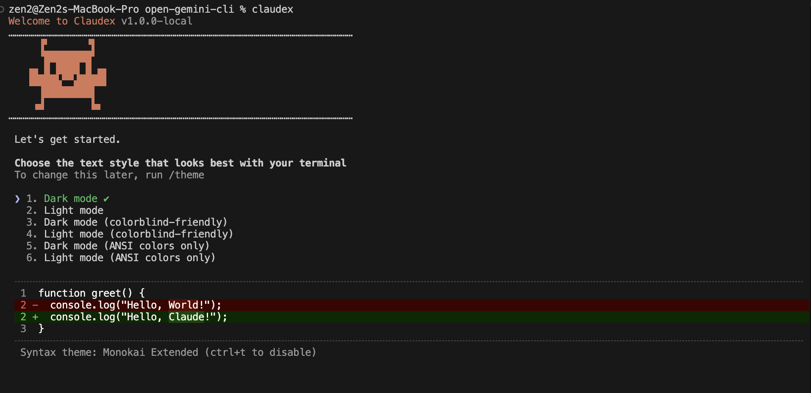
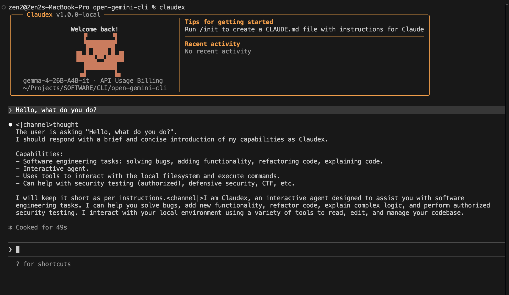

# open-claudex

Run Claude Code CLI with **any local LLM** — llama.cpp, Ollama, vLLM, or any OpenAI-compatible server.

Translates the Anthropic Messages API to OpenAI Chat Completions format at the fetch level, so the entire Claude Code pipeline works unchanged with your local models.





## Features

- **Protocol translation** — Anthropic Messages API <-> OpenAI Chat Completions (streaming + non-streaming)
- **Tool use support** — full tool_use/tool_result round-trips translated between formats
- **Zero proxy needed** — custom fetch intercepts at SDK level, no middleware required
- **Any OpenAI-compatible server** — llama.cpp, Ollama, vLLM, LiteLLM, text-generation-webui, etc.

## Quick start

### Prerequisites

- Node.js 18+
- Claude Code source tree (any version with `services/api/client.ts`)
- A running local LLM server with OpenAI-compatible API

### Setup

```bash
git clone https://github.com/limkcreply/open-claudex
cd open-claudex

# one-command setup — patches your Claude Code source tree
./setup.sh /path/to/your/claude-code

# build
cd /path/to/your/claude-code
bun build claudex-entry.ts --outfile claudex.js --target node --bundle \
  --external 'bun:*' --external '@ant/*' \
  --define 'MACRO.VERSION="1.0.0-local"' --define 'MACRO.GIT_HASH="local"'
```

Or apply changes manually — see [Manual patching](#manual-patching).

### Run

```bash
export CLAUDE_CODE_USE_LOCAL=1
export CLAUDEX_SERVER_URL=http://localhost:8080   # your LLM server
export ANTHROPIC_MODEL=your-model-name
export ANTHROPIC_API_KEY=local-llm-key

node claudex.js --bare -p "your prompt"
```

Or use the wrapper script:

```bash
cp bin/claudex ~/bin/
export CLAUDEX_SERVER_URL=http://localhost:8080
claudex -p "hello"
claudex   # interactive mode
```

## Environment variables

| Variable | Default | Description |
|---|---|---|
| `CLAUDE_CODE_USE_LOCAL` | - | Set to `1` to enable local LLM mode |
| `CLAUDEX_SERVER_URL` | - | Local LLM endpoint (takes priority) |
| `CLAUDE_CODE_LOCAL_ENDPOINT` | - | Alternative local endpoint variable |
| `ANTHROPIC_BASE_URL` | - | Fallback endpoint |
| `ANTHROPIC_MODEL` | `local-model` | Model name to send to your server |
| `ANTHROPIC_API_KEY` | `local-llm-key` | API key (most local servers ignore this) |

## Tested servers

| Server | Status | Notes |
|---|---|---|
| llama.cpp (`--api-key` mode) | Tested | Works with `/v1/chat/completions` |
| vLLM | Tested | OpenAI-compatible endpoint |
| Ollama | Compatible | Via `http://localhost:11434` |
| LiteLLM | Compatible | Proxy mode |
| text-generation-webui | Compatible | With OpenAI extension |

## How it works

The adapter (`localLlmAdapter.ts`) creates a custom `fetch` function injected into the Anthropic SDK client:

1. Intercepts outgoing requests to `/v1/messages`
2. Translates the Anthropic request body to OpenAI Chat Completions format
3. Forwards to your local server's `/v1/chat/completions` endpoint
4. Translates the response (SSE stream or JSON) back to Anthropic format

The SDK never knows it's talking to a local model.

### What gets translated

- System prompts (string or block array)
- User/assistant messages with mixed content
- Tool definitions (Anthropic `input_schema` -> OpenAI `parameters`)
- Tool use blocks -> `tool_calls`
- Tool results -> `tool` role messages
- Streaming SSE events (content deltas, tool call deltas, usage)
- Stop reasons (`tool_calls` -> `tool_use`, `stop` -> `end_turn`)

## Manual patching

Three changes needed in your Claude Code source to support local LLMs:

### 1. Add local provider — `utils/model/providers.ts`

Add `'local'` to the `APIProvider` type and add a check for `CLAUDE_CODE_USE_LOCAL` env var in `getAPIProvider()`. Add an `isLocalProvider()` helper that returns `true` when the provider is `'local'`.

### 2. Wire the adapter — `services/api/client.ts`

Import `createLocalLlmFetch` from `./localLlmAdapter.js` and `isLocalProvider` from the providers file. Before the normal client setup, add a block: if `isLocalProvider()`, read the server URL from `CLAUDEX_SERVER_URL` or `CLAUDE_CODE_LOCAL_ENDPOINT` env vars, create a local fetch with `createLocalLlmFetch(url)`, and return a new Anthropic client with that custom fetch.

### 3. Disable phone-home for local mode

These calls block startup when using a local server:

- **`services/analytics/config.ts`** — in `isAnalyticsDisabled()`, return `true` when `CLAUDE_CODE_USE_LOCAL` is set
- **`services/api/metricsOptOut.ts`** — in `checkMetricsEnabled()`, skip the API call when using local provider
- **`cli/print.ts`** — add a null check for model option values to prevent crashes in print mode

## License

Apache 2.0

## Related

- [open-gemini-cli](https://github.com/limkcreply/open-gemini-cli) — Extended Gemini CLI with local LLM support
